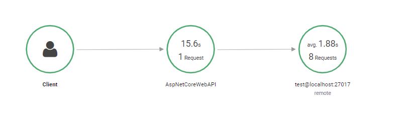

# Kevsoft.AWSXRayRecorder.Handlers.MongoDB [](https://github.com/kevbite/Kevsoft.AWSXRayRecorder.Handlers.MongoDB/actions/workflows/continuous-integration-workflow.yml) [](https://www.nuget.org/packages/Kevsoft.AWSXRayRecorder.Handlers.MongoDB) [](https://www.nuget.org/packages/Kevsoft.AWSXRayRecorder.Handlers.MongoDB)

.NET library to trace MongoDB queries with AWS XRay



## Getting Started

### Installing Package

**Kevsoft.AWSXRayRecorder.Handlers.MongoDB** can be installed directly via the package manager console by executing the following commandlet:

```powershell
Install-Package Kevsoft.AWSXRayRecorder.Handlers.MongoDB
```

alternative you can use the dotnet CLI.

```bash
dotnet add package Kevsoft.AWSXRayRecorder.Handlers.MongoDB
```

## Usage

### Configuring MongoDB Client

When creating a MongoDB client you'll need to add some extra configuration with the `ConfigureXRay` extension method:
```csharp
var settings = new MongoClientSettings
      {
            Server = new MongoServerAddress("localhost")
      }.ConfigureXRay();
var mongoClient = new MongoClient(settings);
```

You can also configure it straight from the MongoUrl:

```csharp
var mongoUrl = MongoUrl.Create("mongodb://localhost");
var settings = MongoClientSettings.FromUrl(mongoUrl)
      .ConfigureXRay();
var mongoClient = new MongoClient(settings);
```

Once configured then the queries to MongoDB will be sampled based on your [XRay sampling configuration](https://docs.aws.amazon.com/xray/latest/devguide/xray-sdk-dotnet-configuration.html#xray-sdk-dotnet-configuration-sampling).

### Mongo XRay Options

The `ConfigureXRay` extension method can accept an additional `MongoXRayOptions` object that allows you to configure what is traced to AWS XRay.

#### Filtering Commands

By default the library filters out the following MongoDB commands sent to the server:
- buildInfo
- getLastError
- isMaster
- ping
- saslStart
- saslContinue

If you require these to commands to be traced, you can clear (or remove) the filtered commands:
```csharp
var mongoXRayOptions = new MongoXRayOptions();
mongoXRayOptions.FilteredCommands.Clear();

var mongoClientSettings = new MongoClientSettings()
                     .ConfigureXRay(mongoXRayOptions);
```

Additional if you want to omit a command when tracing you can add an extra command, for example if we want to omit the `find` command.

```csharp
var mongoXRayOptions = new MongoXRayOptions();
mongoXRayOptions.FilteredCommands.Add("find");

var mongoClientSettings = new MongoClientSettings()
                     .ConfigureXRay(mongoXRayOptions);
```

#### Disabling Command Text

By default the library add the command to the AWS XRay annotations, however, if you're sending across secret information you might want to disable this.
```csharp
var mongoXRayOptions = new MongoXRayOptions
{
   EnableMongoCommandTextInstrumentation = false
};

var mongoClientSettings = new MongoClientSettings()
                     .ConfigureXRay(mongoXRayOptions);
```

#### Adjusting Max Query Time

The library has to keep trace of currently inflight queries, however, this could be come problematic if no query every finishes or spans for days. The library sets a sensible default of 4 hours, but you can change this by settings the `MaxQueryTime` on the settings:
```csharp
var mongoXRayOptions = new MongoXRayOptions
{
   MaxQueryTime = TimeSpan.FromSeconds(30)
};

var mongoClientSettings = new MongoClientSettings()
                     .ConfigureXRay(mongoXRayOptions);
```

## Samples

The [samples](samples/) folder containers examples of how you could use the Library.

## Contributing

1. Issue
1. Fork
1. Hack!
1. Pull Request

